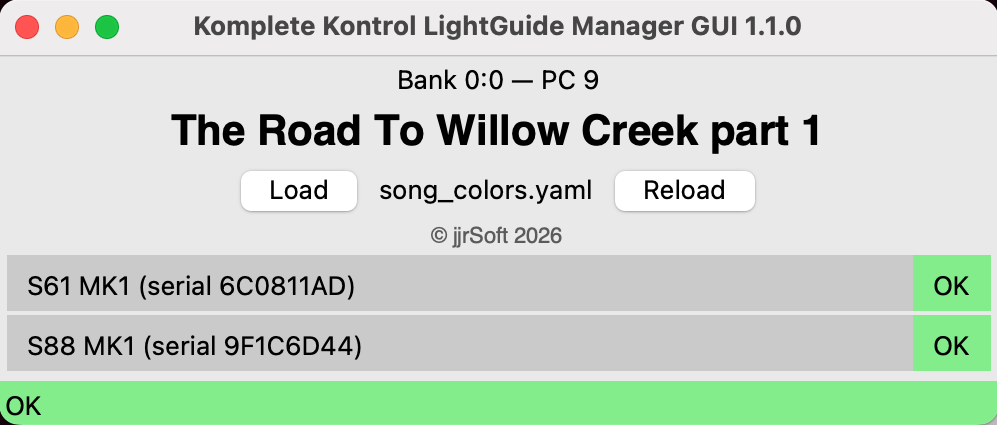
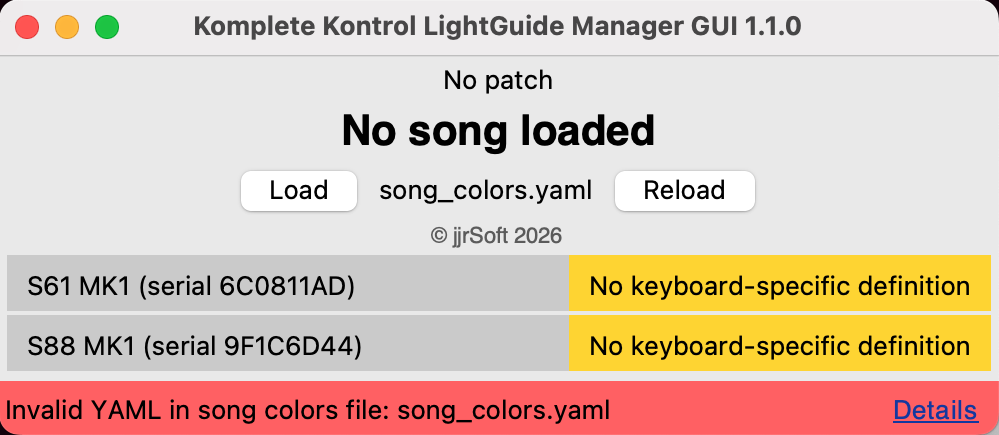
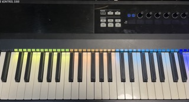

# Komplete Kontrol LightGuide Manager

Komplete Kontrol LightGuide Manager is a lightweight macOS utility for controlling the Native Instruments Komplete Kontrol Light Guide independently of the Komplete Kontrol software.

The application listens for MIDI Bank Select and Program Change messages, then updates the keyboard Light Guide according to the definitions for that bank/program combination, as stored in a YAML configuration file.

Designed for live performance use with applications such as VST Live.

## Features

- No Komplete Kontrol software required: direct HID communication with supported Komplete Kontrol MK1 and MK2 keyboards
- Multiple simultaneous connections are supported
- Automatic keyboard detection with per-model key counts and Light Guide protocols
- Inline keyboard rows showing each connected model, serial number, and configuration status
- MIDI-driven configuration (song) selection from YAML-based definitions


  - Definitions for the Light Guide are loaded from `song_colors.yaml` in the application folder.
  - Supports named colors (from `colors.yaml`), RGB hex values, and integer RGB values.

- Validation of YAML structure, MIDI ranges, duplicate definitions, and overlapping light ranges
- By default, `song_colors.yaml` is loaded from the application folder. The `Load` button opens a file dialog so you can load a different song colors YAML file without restarting the app.
- `Reload` reloads both `colors.yaml` and `song_colors.yaml` from the currently loaded path.
- The label next to the buttons shows the file name of the currently loaded song colors configuration.
- The last folder used in the `Load` dialog is remembered across restarts in `app_settings.json`.
- Fast lookup using precompiled `(bank MSB, program)` mappings

## Supported Hardware

The application detects these USB HID product IDs automatically:

| Model | Protocol | Keys | Product ID |
|---|---:|---:|---:|
| Komplete Kontrol S25 MK1 | MK1 | 25 | `0x1340` |
| Komplete Kontrol S49 MK1 | MK1 | 49 | `0x1350` |
| Komplete Kontrol S61 MK1 | MK1 | 61 | `0x1360` |
| Komplete Kontrol S88 MK1 | MK1 | 88 | `0x1410` |
| Komplete Kontrol S49 MK2 | MK2 | 49 | `0x1610` |
| Komplete Kontrol S61 MK2 | MK2 | 61 | `0x1620` |
| Komplete Kontrol S88 MK2 | MK2 | 88 | `0x1630` |

MK1 keyboards use RGB Light Guide packets. MK2 keyboards use the MK2 per-key packet protocol and the built-in color mapping.

**Note:** Only the S61 MK1 and S88 MK1 have been tested with this application. Support for other configurations is based on [SynthesiaKontrol](https://github.com/ojacques/SynthesiaKontrol/blob/master/SynthesiaKontrol.py).

## Usage

### Connection Diagram

```text
VST host: select a program (song)
    │
    ├── Bank Select (CC0)
    └── Program Change
            │
            ▼
IAC Driver "KompleteKontrolLightGuide"
            │
            ▼
KompleteKontrolLightGuide
            │
            ▼
USB HID
            │
            ▼
Supported Komplete Kontrol keyboard
```

A song change in the host sends bank and program changes, which immediately update the keyboard Light Guide.

### The GUI

The GUI looks like this:



* The top line shows the latest bank and patch ("No patch" until a bank or patch change is received).
* The next line shows the corresponding song name in a large font ("No song loaded" until a song is selected by a patch change, or if the received bank and patch do not match an entry in the YAML file).
* The middle section contains the `Load` and `Reload` buttons, with a text field between them showing the name of the currently loaded song color definition file.
  * Use `Load` to select a different song color definition file. The selected folder is remembered, so the file dialog opens to that folder the next time you load a file.
  * Use `Reload` to reload the current song color definition file. This is useful when you have modified the definitions while developing Light Guide colors for different songs.
* Below the copyright notice, all connected Komplete Kontrol keyboards are listed.
  * Models and serial numbers are shown so you can distinguish keyboards, even when multiple keyboards of the same model are connected.
  * The status of each keyboard and its Light Guide definition appears at the end of the line.
    * A green `OK` badge means a matching definition exists.
    * A yellow badge means the connected keyboard has no definition.
    * A configured model/serial pair that is not currently connected appears with a red `Not connected` badge, alongside any connected keyboard of that model.
  * The application scans regularly for connected keyboards, so a newly connected keyboard will appear in the list shortly.
* The status bar at the bottom displays the general status.
  * If there are issues, the status bar turns yellow or red, and a link appears on the right to open a dialog listing the problems.

### Startup Behavior

Upon startup, the application loads color names and default song color definitions from the YAML files `colors.yaml` and `song_colors.yaml` in the same folder as the executable or script (`~/Applications/KompleteKontrolLightGuide` if installed as described below).

The files are checked for syntax errors at startup and whenever they are loaded or reloaded. If there are errors, the status line turns red and a `Details` link appears at the end.



Clicking the link opens a dialog box that lists the errors encountered.

### Action

Whenever the application receives a MIDI bank/patch change combination, it sets the Light Guide colors on the connected keyboards according to the loaded song color definitions in the YAML file.




## Installation

### macOS MIDI Setup

Enable the IAC Driver:

```text
Applications
    → Utilities
    → Audio MIDI Setup
    → MIDI Studio
    → IAC Driver
```

Enable:

```text
Device is online
```

Create a port named:

```text
KompleteKontrolLightGuide
```

The application listens on:

```text
IAC Driver KompleteKontrolLightGuide
```

### Python Environment

Install dependencies, preferably in a virtual environment:

The dependencies are listed in `requirements.txt` and can be installed with:

```bash
pip install -r requirements.txt
```

This includes PyInstaller, which is required to build the standalone executable.

## Running

The files `colors.yaml` and `song_colors.yaml` must be next to `komplete_kontrol_lightguide.py` when you run the application, because it loads both files from that directory. Sample files are provided in the repository root for initial testing, but you will likely want to customize at least `song_colors.yaml` for your songs and keyboard zones.

An `app_settings.json` file is created in the same directory to remember the last folder used with the `Load` button.

Run the application from source with:

```bash
python komplete_kontrol_lightguide.py
```

## Running as a Standalone Executable

### Building the Executable

Install PyInstaller:

```bash
pip install pyinstaller
```

Build:

```bash
pyinstaller komplete_kontrol_lightguide.spec
```

The executable will be found in:

```text
dist/
```

The generated app uses `komplete_kontrol_lightguide.icns` as its macOS icon.

### Install the Executable

Copy the `Komplete Kontrol Lightguide.app` application and the YAML files to `~/Applications/KompleteKontrolLightGuide`.

This lets you start the app from Launchpad like any other application.

## YAML Format

The song definitions for the Light Guide are stored in a YAML file.
By default, the application loads `song_colors.yaml` from the same directory as the source script or executable.
You can load any YAML file manually from the GUI.

### Single-Keyboard Setup

For a single-keyboard setup, the YAML file can be quite simple.

The root-level `banks` list provides shared default banks for every connected keyboard.

Each bank has a bank select `msb` value. Within each bank is a list of `songs`, each with a `title`, a program change number (`pc`), and a `lights` entry. The `lights` entry is a list of zones and colors that defines the Light Guide appearance.

Program change (`pc`) and bank selection MSB (`msb`, CC0) values are zero-based MIDI values from `0` to `127`. The bank selection LSB is currently unused and is treated as `0`.

Zones are note ranges written from the lowest to the highest note, with the notes separated by a dash. Each note uses the format `[A-G]number`. Normally, middle C is `C4`, but MIDI note-naming conventions differ. The optional top-level `middleC` entry lets you specify which note represents middle C (MIDI note 60). Common alternatives are `C3` and `C5`. Negative octave numbers are also allowed, but all notes must resolve to MIDI note numbers from `0` to `127`.

The Light Guide illuminates all keys between and including the lowest and highest notes with the specified color. In addition to named colors, several other formats are supported, as described in [Supported Color Formats](#supported-color-formats).

Example:

```yaml
# Comments beginning with a hash are supported.

# VSTLive convention: MIDI note 60 is C3 unlike the typical C4.
# C4 is used as the middle C if this entry does not exist.
middleC: C3

banks:

  - msb: 0
    songs:

      - title: Song A
        pc: 1
        lights:
          C1-C#2: yellow
          D2-C#3: orange
          D3-G3: 1245028
          G#3-A4: 00FF14
          Bb4-C5: 1264FF
          C#5-E5: red

      - title: Song B
        pc: 2
        lights:
          C1-B2: blue
          C3-B4: green
          C5-C5: red
```

### Multi-Keyboard Setup

For multi-keyboard setups, you may need to distinguish between keyboards. If you want to apply the same Light Guide zone settings to all keyboards, you can use only the root-level `banks` list. Otherwise, use a `keyboards` entry containing a `banks` list for each keyboard. The application identifies each keyboard by `model` and, optionally, `serial` when multiple keyboards of the same model are connected. The model must be one of the recognized models.

A top-level `banks` list serves as the default for any keyboard that does not match the model and serial number in a `keyboards` entry.

```yaml
middleC: C3

keyboards:
  - model: S88 MK1
    banks:
      - msb: 0
        songs:
          - title: Song A
            pc: 1
            lights:
              C1-C3: blue

  - model: S61 MK1
    serial: "6C0811AD"
    banks:
      - msb: 0
        songs:
          - title: Song A
            pc: 1
            lights:
              C1-C3: red

  # A second S61 MK1 needs its own serial number.
  - model: S61 MK1
    serial: "ANOTHER_S61_SERIAL"
    banks:
      - msb: 0
        songs:
          - title: Song A
            pc: 1
            lights:
              C1-C3: yellow
```

## Supported Color Formats

### Named Colors

```yaml
C3-C4: red
D4-E4: yellow
F4-G4: blue
```

### Hex Strings

```yaml
C3-C4: "#FF0000"
D4-E4: 00FF00
F4-G4: FF0000
```

Hex strings may be written without quotes. Quote values beginning with `#` because YAML treats an unquoted `#` as a comment marker.

### Integer RGB Values

```yaml
C3-C4: 0xFF0000
D4-E4: 16711680
```

Both values are equivalent to:

```text
FF0000
```

### RGB Lists

```yaml
C3-C4: [255, 0, 0]
D4-E4: [0, 255, 0]
F4-G4: [0, 0, 255]
```

RGB list channels may be decimal or hexadecimal integers:

```yaml
C3-C4: [0xFF, 0x00, 0x00]
```

RGB list channels must each resolve to an integer from `0` to `255`.

## Built-In Colors

Built-in colors are defined in `colors.yaml`. This can be modified if necessary. By default, the colors are as follows:

| Name | RGB |
|--------|--------|
| black | 000000 |
| white | FFFFFF |
| red | FF0000 |
| green | 00FF00 |
| blue | 0000FF |
| yellow | FFFF00 |
| cyan | 00FFFF |
| magenta | FF00FF |
| orange | FFB000 |
| purple | 8000FF |
| pink | FF40A0 |
| lime | 80FF00 |
| teal | 00B0A0 |
| sky | 40C0FF |
| violet | FF00FF |
| dimred | 400000 |
| dimgreen | 004000 |
| dimblue | 000040 |
| dimwhite | 202020 |


## Runtime Errors

Unknown MIDI patches are non-fatal: the current song and lights remain unchanged and the status bar shows a warning.

Invalid configuration, MIDI input failures, and keyboard failures show an error status. `Reload` and `Load` remain enabled regardless of keyboard availability so configuration can be corrected and retried.


## Credits

This project is based on previous reverse-engineering work by members of the Native Instruments community, including:

- jasonbrent https://github.com/jasonbrent/SynthesiaKomplete
- Olivier Jacques https://github.com/ojacques/SynthesiaKontrol
- Simon Alveteg https://github.com/simonalveteg/KompleteKontrolLightGuide

This project extends those discoveries with song-based Light Guide control for live performance workflows.

## License

This project is licensed under the MIT License. See [LICENSE](LICENSE).

## Version History

- **1.1.0**
  - Added support for multiple keyboards with per-keyboard light configurations, including multiple keyboards of the same model via serial number.
  - Added a live list of connected keyboards with status badges: OK, Warning, or Not connected. The Not connected badge appears when the configuration requests a specific device that is not present. Typos and unsupported models are not shown because they cannot be resolved.
  - Renamed the `Reload Song Colors` button to `Reload`; added a label showing the currently loaded song colors file name and a `Load` button for selecting any song colors YAML file via a file dialog. The last-used folder is remembered in `app_settings.json`.
  - Improved YAML validation and error handling.
  - Added warnings for mismatching song names when the same bank/PC is defined for multiple keyboards.
  - Renamed the IAC MIDI port to `KompleteKontrolLightGuide` and renamed the script and related files from `komplete_lightguide*` to `komplete_kontrol_lightguide*`.
  - Adopted semantic versioning.

- **1.0**
  - Initial release.